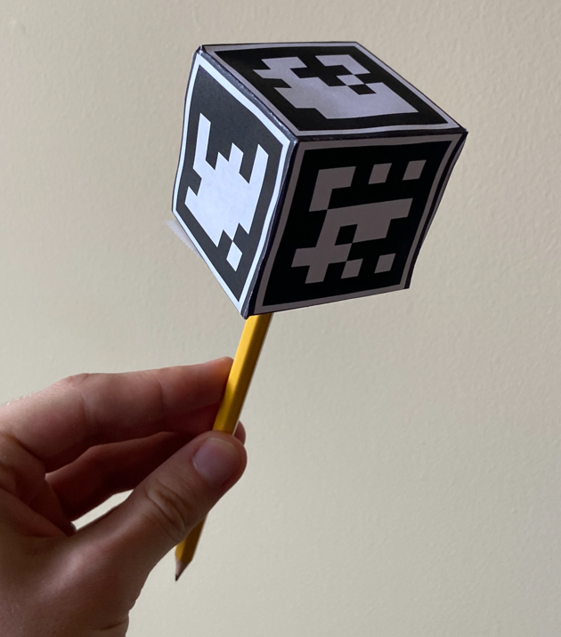

# CSCHacks 2021 Project: Remote Pen

# Project Goal

- The goal of this project is to create a touchless pen 
that can be used to draw/control the mouse on non-touchscreen computers
via the webcam and computer vision.


# Team

Jared Peters
- Pitt Computer Science, 2024
- jap300@pitt.edu
- [github.com/jrddp](www.github.com/jrddp)

# MVP

As of 10/24/2021 you can demo a working prototype of the project as described below

## 1. Install software

- If you have not already, install Python 3 via https://www.python.org/downloads/.
- Install the following dependencies with [pip3](https://pypi.org/project/pip/) using the following command: \
  ```pip3 install opencv-python opencv-contrib-python pyautogui```
- Clone this github repo \
  ```git clone https://github.com/jrddp/TheMagicPen```

## 2. Construct your Magic Pen

To assemble the magic pen, you will need the following supplies
- A printed copy of the [Magic Pen Print Out/Instruction Sheet](./PrintOut.pdf)
- Scissors
- Tape
- A pen/pencil (Anything stick-like should work)

Follow the instructions on the [print out](./PrintOut.pdf). The end result should look similar to the image below.


## 3. Running and using the software

To use the pen, start the software by running the following command within the cloned directory:
```python3 main.py```

Once the software is running, you should be able to control your mouse using the magic pen!
If the "render_video" variable is enabled in main.py, you will also get video feedback on the detection of your pen.

### Using the Magic Pen

Using the magic pen is simple. To move the mouse, simply hold the pen 
in front of your webcam and your mouse will move accordingly.

To drag the mouse with the left mouse button held, point to the top of the pen towards the camera so that it sees 
only the marker on the top side.